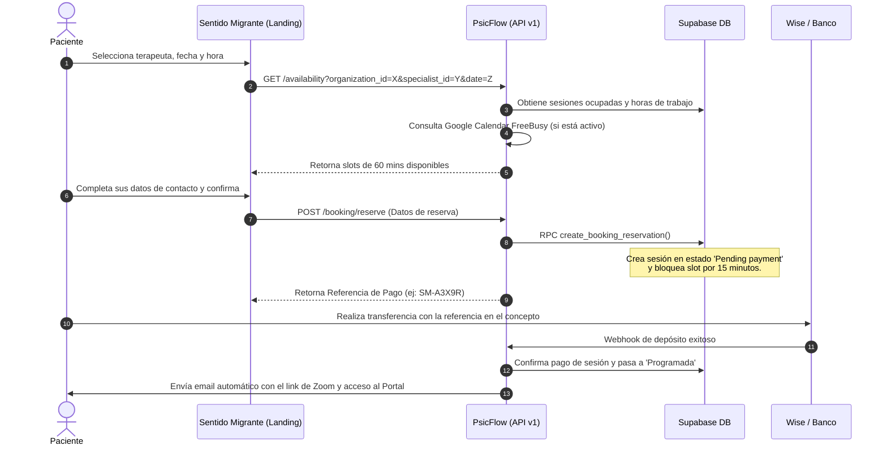

# Ecosistema PsicFlow & Sentido Migrante: Especificación Técnica de Arquitectura

Este documento describe la arquitectura global, interconexiones y flujos del sistema compuesto por el monorepo de **PsicFlow (SaaS y Portal del Paciente)** y el repositorio independiente de **Sentido Migrante (Landing Page)**. Sirve como referencia para el contexto del desarrollo futuro.

---

## 1. Componentes del Ecosistema

El ecosistema está dividido en tres aplicaciones Web independientes y una base de datos centralizada en Supabase:

```
                          +------------------------------------------+
                          |      Sentido Migrante (Landing Page)     |
                          |      Host: www.sentidomigrante.com       |
                          +--------------------+---------------------+
                                               |
                                               | (Headless APIs / JSON)
                                               v
+----------------------------------------------+----------------------------------------------+
| PSICFLOW MONOREPO (apps/)                                                                   |
|                                                                                             |
|   +------------------------------------+            +------------------------------------+  |
|   |         SaaS App (apps/app)        |            |      Patient Portal (apps/portal)  |  |
|   |      Host: app.psicflow.cl         |            |      Host: portal.psicflow.cl      |  |
|   +-----------------+------------------+            +-----------------+------------------+  |
|                     |                                                 |                     |
+---------------------+-------------------------------------------------+---------------------+
                      |                                                 |
                      | (PostgREST / Supabase Client)                   | (PostgREST / Supabase Client)
                      v                                                 v
         +------------+-------------------------------------------------+------------+
         |                                                                            |
         |                         Supabase Database (PostgreSQL)                     |
         |                                                                            |
         +----------------------------------------------------------------------------+
```

### A. Landing Page: Sentido Migrante (`Sentido_Migrante`)
* **Framework**: Next.js (App Router).
* **Propósito**: Web pública dirigida a pacientes y clientes en Suiza y Alemania. Expone los profesionales de la clínica, sus biografías, sus artículos del blog, reseñas y el calendario para agendar sesiones.
* **Integración**: Funciona como un cliente **Headless** (decapitado). Obtiene los datos del terapeuta, horarios libres y procesa reservas llamando a las APIs de PsicFlow con su `organization_id` correspondiente (`fa28bcff-1321-4cb4-b5ef-64ffed1662cb`).

### B. SaaS: PsicFlow (`PsicFlow/apps/app`)
* **Framework**: Next.js (Pages Router).
* **Propósito**: Plataforma interna de administración para psicólogos y clínicas. Permite gestionar:
  - Fichas clínicas e historiales de pacientes.
  - Calendarios y agendas de sesiones (con sincronización opcional con Google Calendar).
  - Emisión y estado de boletas de honorarios y reportes financieros.
  - Redacción de artículos para el blog y moderación de reseñas.
  - Conexión y configuración de sus pasarelas de cobro.

### C. Portal del Paciente (`PsicFlow/apps/portal`)
* **Framework**: Next.js (Pages Router).
* **Propósito**: Interfaz web simplificada para el paciente final. Permite:
  - Autenticación con Google o email corporativo.
  - Visualizar sus sesiones futuras y pasadas.
  - Descargar recursos psicoeducativos compartidos por su terapeuta (Biblioteca).
  - Gestionar, reprogramar o cancelar citas.

### D. Base de Datos Central: Supabase
* **Base de Datos**: PostgreSQL con seguridad a nivel de filas (**Row Level Security - RLS**).
* **Multi-tenant**: Las tablas se aíslan de forma inmutable filtrando por `organization_id` usando la función personalizada `get_current_tenant()`.

---

## 2. Flujo de Trabajo Multi-Tenant e Integración de Reserva Headless

El flujo completo de agendamiento y pago manual opera a través de las siguientes fases:



---

## 3. Estrategia de Desacoplamiento para el SaaS Comercializable

Para comercializar PsicFlow a distintos profesionales y clínicas, el ecosistema se adaptará a tres planes de suscripción y una configuración dinámica por base de datos:

### A. Parametrización en Base de Datos
Se eliminan las referencias en duro (como el prefijo `"SM-"` en las transacciones o los datos bancarios en la landing). Se crean dos tablas en el esquema público de Supabase:
1. **`booking_settings`**:
   - `organization_id`: UUID de la clínica.
   - `booking_prefix`: Prefijo personalizado de transacción (ej: `SM` para Sentido Migrante, `PF` por defecto).
   - `currency`: Moneda predeterminada de agendamiento (`CLP`, `EUR`, `CHF`, `USD`).
   - `terms_text`: Consentimiento legal o Protocolo de Crisis.
2. **`organization_payment_gateways`**:
   - `provider`: ENUM (`wise`, `stripe`, `mercadopago`, `dlocal_go`, `manual`).
   - `credentials`: JSONB que almacena llaves de API secretas/públicas, URLs de pago o datos bancarios según el proveedor.
   - `is_active`: Estado del procesador de pagos.

### B. Niveles de Planes (Feature Gating)
El SaaS limitará el acceso a vistas en la UI (`Layout.tsx`) y denegará peticiones en endpoints específicos (`planGuard.ts`) en base al plan de la clínica:
- **Starter (Individual Clínico)**: 1 usuario profesional. Gestión clínica privada únicamente. Oculta: artículos, reseñas, agendamiento público y portal.
- **Pro (Equipo Clínico)**: Hasta 5 usuarios. Mismas características privadas que el plan Starter.
- **Enterprise / Grow (Full Suite)**: Usuarios ilimitados. Habilita: portal del paciente, agenda de reservas públicas (micrositio/widget) y blog/reseñas.

### C. Estrategia de Correos Electrónicos
- **Dominio Central**: Los correos transaccionales por defecto saldrán desde el dominio verificado del SaaS (`no-reply@psicflow.cl`), modificando dinámicamente el nombre de remitente en función de la clínica que gatilla el evento (`"Clínica Sentido Migrante" <no-reply@psicflow.cl>`).
- **Dominio Personalizado (Enterprise)**: Módulo opcional para que clínicas grandes puedan certificar sus propios registros DNS (DKIM/SPF) y despachar con su propio remitente.

---

## 4. Estrategia de Versionado y Entornos

* **Ramas Git**: Los desarrollos de desacoplamiento se realizan en paralelo en la rama `feature/saas-multitenant` de ambos repositorios.
* **Vercel Preview Deployments**: Se utilizan URLs de preview aisladas asociadas a la rama git para probar la integración sin tocar los entornos productivos de Sentido Migrante.
* **Supabase Local Development**: Las migraciones SQL se crean y testean localmente usando Supabase CLI antes de ser desplegadas a producción.
